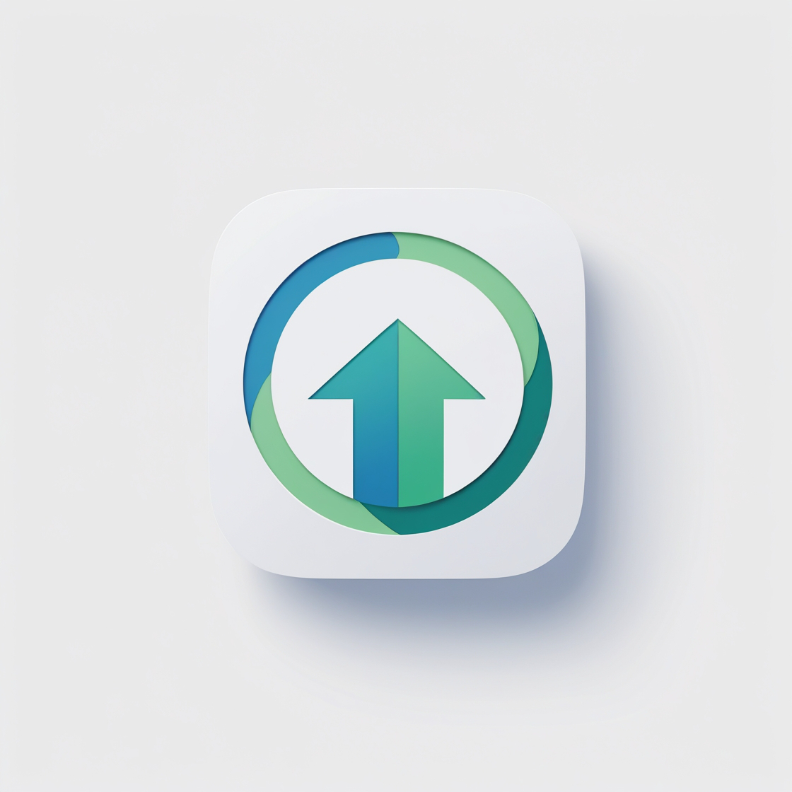

# FocusPath 

[](https://app.rajeshkalidandi.online)
[](https://opensource.org/licenses/MIT)
[](https://github.com/RajeshKalidandi/focuspath/issues)

Transform your life with FocusPath - The #1 app for overcoming addiction, improving focus, and achieving personal growth. Free, private, and effective.

<div align="center">
  
</div>

## 🌟 Features

- 🕒 **Focus Timer**: Track and improve your focus sessions
- 📊 **Progress Tracking**: Monitor your journey with detailed statistics
- 🎯 **Goal Setting**: Set and achieve personal milestones
- 📱 **PWA Support**: Install on any device, works offline
- 🔒 **Privacy First**: Your data stays private and secure
- 🎨 **Beautiful UI**: Modern, intuitive interface
- 🚀 **Performance**: Fast and responsive experience

## 🚀 Getting Started

### Prerequisites

- Node.js 18.x or higher
- npm 9.x or higher

### Installation

1. Clone the repository:
```bash
git clone https://github.com/RajeshKalidandi/focuspath.git
cd focuspath
```

2. Install dependencies:
```bash
npm install
```

3. Start the development server:
```bash
npm run dev
```

4. Open [http://localhost:5173](http://localhost:5173) in your browser.

## 📱 PWA Installation

1. Visit [https://app.rajeshkalidandi.online](https://app.rajeshkalidandi.online)
2. Click the "Install" button in your browser
3. Follow the installation prompts
4. Enjoy FocusPath on your device!

## 🛠️ Tech Stack

- **Frontend**:
  - React 18
  - TypeScript
  - Tailwind CSS
  - Vite
  - Zustand (State Management)

- **Backend**:
  - Supabase
  - PostgreSQL

- **PWA Features**:
  - Service Workers
  - Offline Support
  - Push Notifications
  - App-like Experience

## 🔍 SEO Optimization

FocusPath is optimized for search engines with:

- Comprehensive meta tags
- Open Graph support
- Twitter Card integration
- Schema.org markup
- XML sitemap
- Robots.txt configuration
- Mobile-first indexing
- Performance optimization

## 🤝 Contributing

We welcome contributions! Here's how you can help:

1. Fork the repository
2. Create a feature branch: `git checkout -b feature/amazing-feature`
3. Commit your changes: `git commit -m '[Cursor] Add amazing feature'`
4. Push to the branch: `git push origin feature/amazing-feature`
5. Open a Pull Request

See our [Contributing Guidelines](CONTRIBUTING.md) for more details.

## 📝 License

This project is licensed under the MIT License - see the [LICENSE](LICENSE) file for details.

## 🙏 Acknowledgments

- All our amazing contributors
- The open-source community
- Everyone on their journey to self-improvement

## 📞 Support

- Website: [https://app.rajeshkalidandi.online](https://app.rajeshkalidandi.online)
- Email: support@rajeshkalidandi.online
- Issues: [GitHub Issues](https://github.com/RajeshKalidandi/focuspath/issues)

## 🌟 Star History

[](https://star-history.com/#RajeshKalidandi/focuspath&Date)

---

<div align="center">
  Made with ❤️ by the FocusPath Team
</div> 